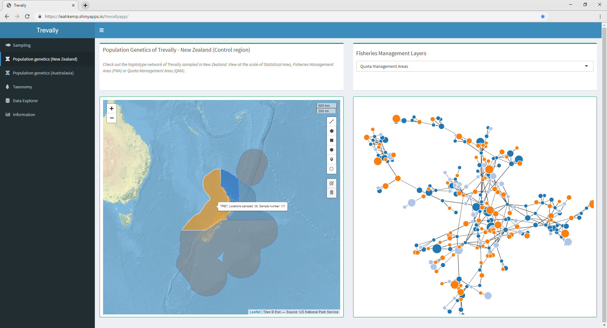

```{r include = FALSE}
knitr::opts_chunk$set(echo = FALSE, message = FALSE, warning = FALSE)
```

```{r echo = FALSE, out.width = "100%", fig.align = "center", fig.cap = "Screenshot of an R Shiny app displaying a few key results of this thesis. You can interact with a live version at: https://leahkemp.shinyapps.io/trevallyapp/."}

```

Key R packages used within R version 3.6.1 to create this thesis and the accompanying app: bookdown [@R-bookdown], dplyr [@R-dplyr], ggplot2 [@R-ggplot2], kableExtra [@R-kableExtra], knitr [@R-knitr], leaflet [@R-leaflet], leafletextras [@R-leaflet.extras], mapview [@R-mapview], networkD3 [@R-networkD3], phylocanvas [@R-phylocanvas], plotly [@R-plotly], rmarkdown [@R-rmarkdown], sf [@R-sf], sp [@R-sp] and tinytex [@R-tinytex].

See the [welly-trevally git repository](https://github.com/leahkemp/welly-trevally) at https://github.com/leahkemp/welly-trevally for the code and documentation associated with this thesis. Additionally, the code for the R Shiny app associated with this thesis can be found at the [trevallyApp git repository](https://github.com/leahkemp/trevallyApp) at https://github.com/leahkemp/trevallyApp.

```{r include=FALSE}
# Code for function to specify tables cells to be italicised
format_cells <- function(df, rows ,cols, value = c("italics")){
  # select the correct markup
  map <- setNames(c("\\textit{", "*", "~~"), c("italics"))
  markup <- map[value]
  for (r in rows){
    for(c in cols){
      # Make sure values are not factors
      df[[c]] <- as.character( df[[c]])
      # Update formatting
      df[r, c] <- paste0(markup, df[r, c], "}")
    }
  }
  return(df)
}
```

\hypersetup{linkcolor=black}
\setcounter{tocdepth}{2}
\tableofcontents
\listoffigures
\listoftables
\newpage